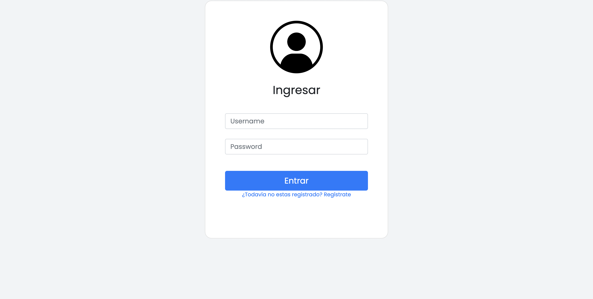
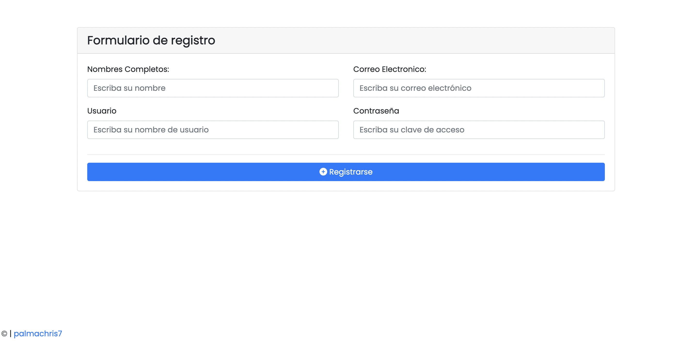
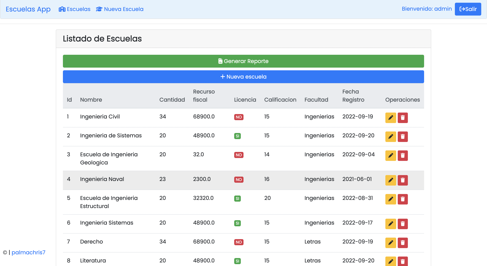
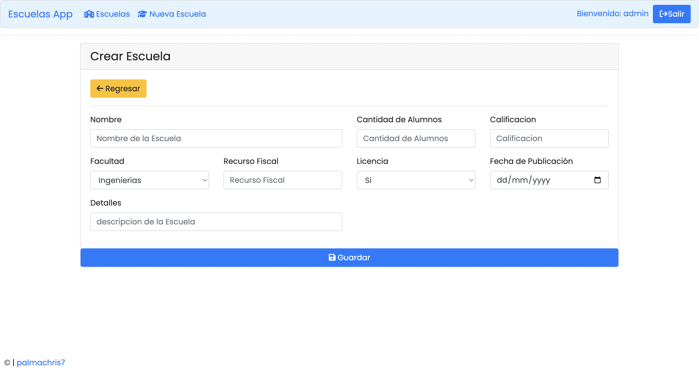
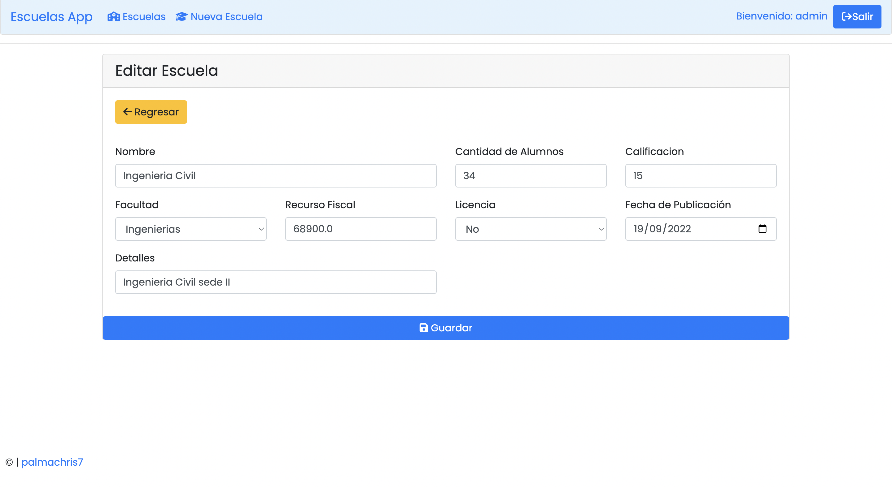
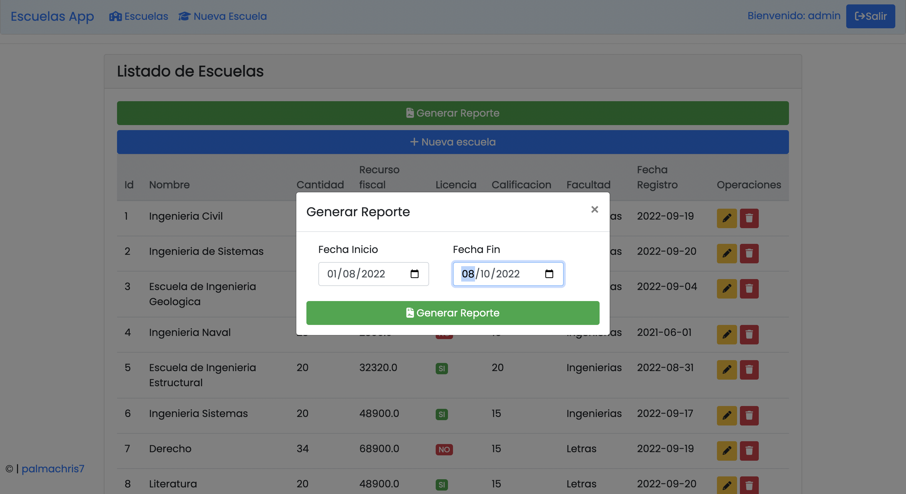
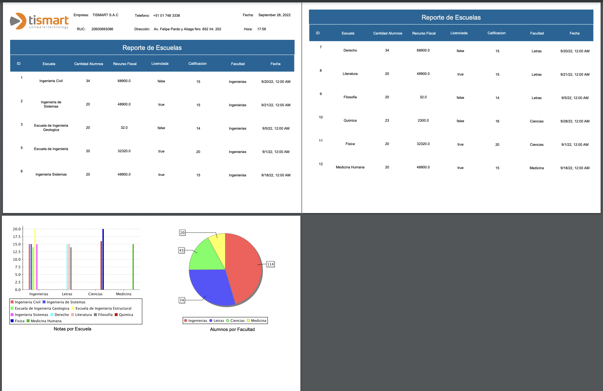

# Escuelas App
Aplicacion CRUD de Escuelas y generación de reporte con. JasperReports

### Vistas:

>Login:

>Registro:

>Listado Escuelas:

>Agregar Escuelas:

>Editar Escuelas:

>Genera Reporte:

>Reporte:

[Base de datos](./src/main/resources/db.sql)
